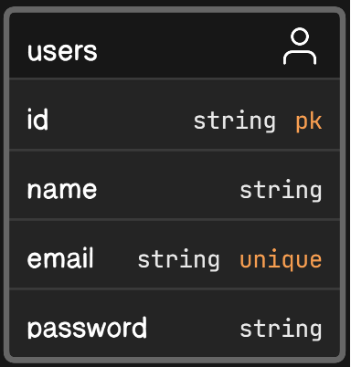
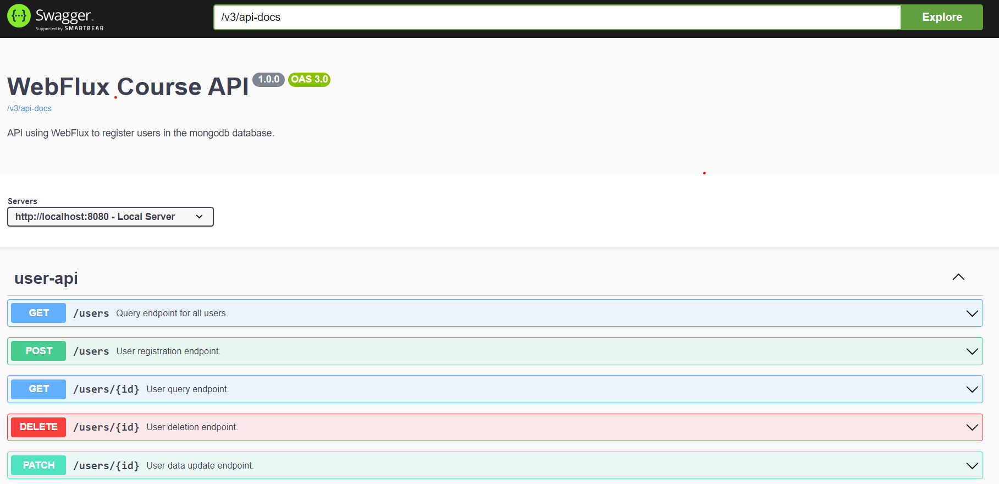

<h1 align="center">
WebfluxCourse
</h1>

<h3 align="center">
Diagrama UML de Usuário definido para o cadastro na base de dados MongoDB
</h3>

  

<h2 align="center">
Swagger gerado para o projeto
</h2>

<h3>Link do swagger do projeto.:</h3>
http://localhost:8080/webjars/swagger-ui/index.html#

  

