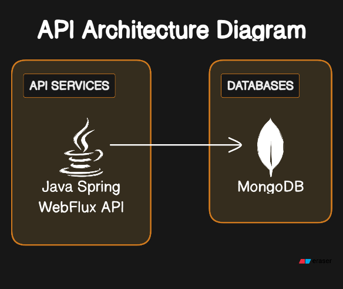
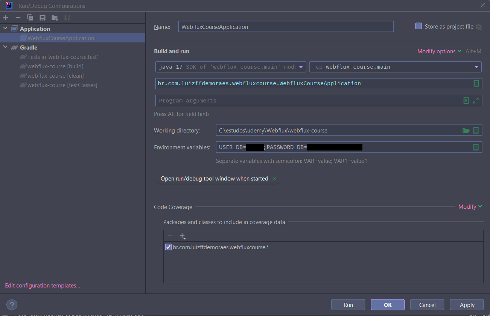
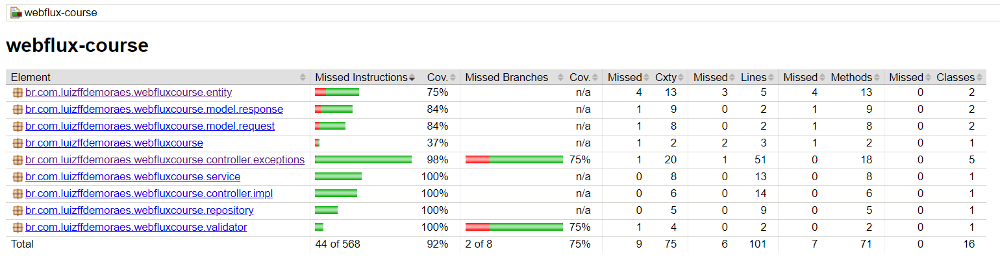

<h1 align="center">
WebfluxCourse
</h1>

<h3 align="center">
Diagrama de arquitetura do projeto.
</h3>

  

### Features

- [x] Cadastro de usuário
- [x] Consulta por id do usuário
- [x] Consulta geral dos usuários
- [x] Atualização do usuário por id
- [x] Remoção de usuários por id

<h3 align="center">
Diagrama UML de Usuário definido para o cadastro na base de dados MongoDB
</h3>

  

<h2 align="center">
Instruções para execução do projeto.:
</h2>

  Definir nas enviroments do projeto USER_DB e PASSWORD_DB

  

<h2 align="center">
Swagger gerado para o projeto
</h2>

<h3>Link do swagger do projeto.:</h3>
http://localhost:8080/webjars/swagger-ui/index.html#

  

<h2 align="center">
Relatório gerado pelo jacoco referente cobertura de testes do projeto
</h2>

 Gerar Relatórios de Cobertura:

 Gerar os relatórios de cobertura usando o comando ./gradlew jacocoTestReport no terminal. Esse comando gera relatórios em diferentes formatos, como XML, CSV e HTML.

 Visualizar Relatórios HTML:

 Você pode visualizar o relatório HTML gerado abrindo o arquivo <b> build/reports/jacoco/html/index.html</b> em um navegador da web.

  

### 🛠 Tecnologias

As seguintes ferramentas foram usadas na construção do projeto:

- [Java 17](https://docs.oracle.com/en/java/javase/17/docs/api/)
- [Spring Boot 3.0.1](https://spring.io/projects/spring-boot)
- [Spring Webflux](https://docs.spring.io/spring-framework/reference/web/webflux.html)
- [MongoDB Atlas](https://www.mongodb.com/cloud/atlas/register?psafe_param=1&utm_content=rlsapostreg&utm_source=google&utm_campaign=search_gs_pl_evergreen_atlas_general_retarget-brand-postreg_gic-null_amers-all_ps-all_desktop_eng_lead&utm_term=&utm_medium=cpc_paid_search&utm_ad=&utm_ad_campaign_id=14412646452&adgroup=131761126052&cq_cmp=14412646452&gad_source=1&gclid=Cj0KCQiA4NWrBhD-ARIsAFCKwWu3ifQr5ou8c2rkEAEJWFW4BpwdeCZJTqLhFQBffMbBk_iV0hPIZNkaAj1VEALw_wcB)
- [Gradle](https://gradle.org/)
